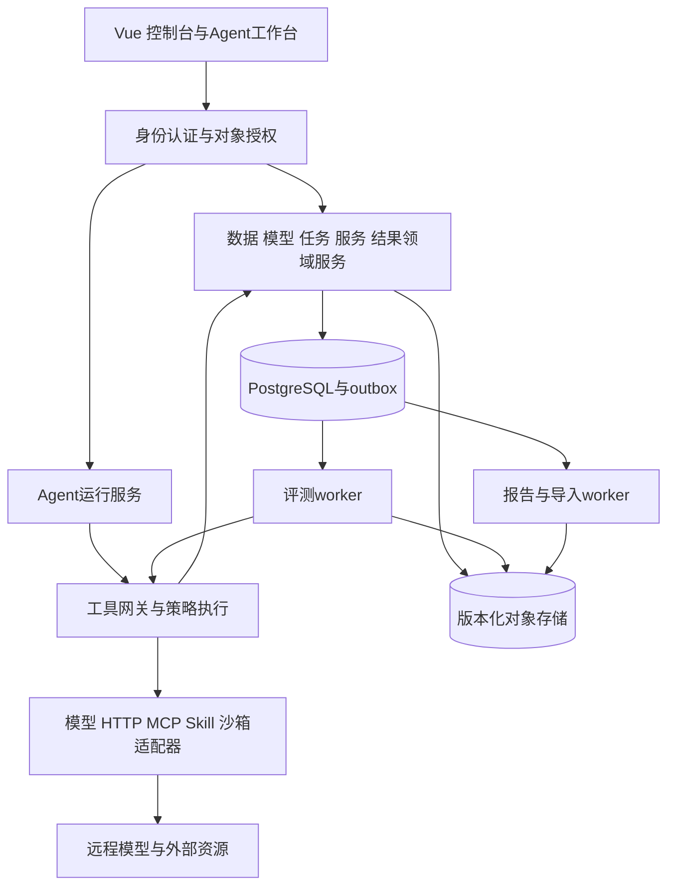

# 平台功能与数据设计

## 1 架构决策

保留 Vue 3、FastAPI、SQLAlchemy 和模块化单体 API，拆出评测执行、Agent运行、报告与导入三类独立 worker。生产使用 PostgreSQL，Redis 只作共享限流、短缓存和唤醒信号，不能作为唯一任务事实来源。媒体、报告、数据文件与快照通过对象存储适配器访问；开发可以使用受限本地目录。SQLite 保留开发演示，不承诺生产并发。

初期用 PostgreSQL work_items 表、短事务和 `FOR UPDATE SKIP LOCKED` 领取工作，业务状态与 outbox 事件同事务提交。需要消息中间件时再增加投递适配器，不同时自研多个调度系统。Agent 使用 LangGraph 持久化图运行时；底层评测 worker 负责样本执行，二者只通过任务服务和事件关联。

这是本项目推荐决策，不是原始文档唯一指定的技术方案。研发时锁定经过兼容测试的依赖版本，不使用浮动 latest。保留现有 API 兼容层，业务校验下沉到领域服务；禁止普通API、Agent、服务单分别维护不同的任务创建规则。

## 2 公共数据约束

新增实体使用 UUID，现有整数 ID 保留；通过关联列渐进迁移。业务表包含 tenant_id、workspace_id、created_by、created_at、updated_at、row_version。版本表包含 content_hash、schema_version、parent_version_id。时间统一UTC带时区；金额用decimal或微元整数；Token非负整数，未知值为null并注明计量状态，不能用0替代。

生产数据库设置外键、唯一约束和行锁；通过 `(tenant_id,id)` 组合关联防止跨租户引用。repository查询必须接收ActorContext，不允许无范围list/get。对象存储键由服务端生成，禁止用户传入任意文件路径，下载必须经过对象权限检查或短时签名URL。

| 实体 | 核心字段和不变量 |
|---|---|
| Tenant、WorkspaceMember | workspace所属tenant；成员role/status；成员撤销后访问即时失效 |
| ResourceVersion、ResourceInstance | resource_id+version唯一，manifest不可变；stable指针与instance lease分离 |
| DatasetVersion | original_file_hash、canonical_content_hash、schema_hash、item_count、quality_run_id；发布后内容不可修改 |
| DatasetRevision、DatasetItemTag | base_version、edits、reason；稳定sample_key；多对多标签；修改生成新版本 |
| ModelVersionConfig | endpoint、served_model、request/response mapping、capabilities、channel、credential_ref；不可变配置 |
| QualityRun、QualityRuleVersion | dataset_version、rule_set_version、dimensions、issues、status；报告与冻结输入绑定 |
| Experiment、EvalRun | 模型/数据/提示词/裁判版本、seed、metric_definition_version、mode、cohort_hash、run_spec_hash |
| EvalAttempt、SampleResult | run/sample/attempt、execution_status、score_status、metrics、passed、evidence_ref、usage、latency、error |
| WorkItem、OutboxEvent | lease_owner/until、fencing_token、attempt、not_before、event_id；至少一次投递并去重 |
| UsageReservation、UsageLedger | run/invocation、reserved/settled/released、input/output tokens、price_version、currency；每调用只结算一次 |
| Artifact、ReportJob | hash、size、mime、storage_key、producer、version、state；文件验证后才ready |
| Benchmark、MetricDefinition | scope、license、dataset/evaluator版本、unit、direction、range、aggregation、threshold、calibration_report |
| Cohort、LeaderboardRelease | 比较集指纹、结果ID、权重版本、发布人、快照hash；缺失指标不能补0 |

## 3 权限和租户隔离

授权为 `动作权限 ∧ 租户成员 ∧ 工作空间范围 ∧ 对象ACL ∧ 数据密级与用途策略`。身份从验证后的会话/服务令牌派生，body中的tenant_id不能覆盖身份。后台作业保存发起者和委托范围，关键动作执行时重验当前权限，服务账号不隐式成为管理员。

平台系统管理员与租户业务管理员分开；跨租户支持诊断需显式临时授权、用途和审计。researcher默认own和显式共享；viewer仅已授权只读，不自动允许敏感原文、执行、审批或凭证访问。租户隔离覆盖下载、SSE、知识检索、日志、快照和检查点。

迁移：创建默认tenant/workspace→按现有creator/owner回填→所有权不明资源进入隔离状态→验证孤儿/跨租户引用→添加约束→启用强制过滤，禁止把历史对象全部公开。

新增权限候选：agent:cancel/resume/replay/configure、knowledge:review、benchmark:create/edit/review、workspace:manage、service:promote、resource:approve。replay表示只读轨迹回放，重新执行需要新run与执行权限。researcher只允许所属范围内的调用、取消、恢复；viewer不授予写权限。每次新增权限必须同步前端按钮与meta.permission、后端require_permission、permissions.json、ACTION_NAMES、必要的RESOURCE名称、rbac.py，并运行 `cd frontend && npm run collect-permissions` 审查差异。

## 4 数据和质量

### 4.1 导入与版本

上传暂存→格式/MIME/大小检查→异步解析→字段映射预览→确认→draft版本→质检→审核→发布。导入状态为uploaded/parsing/preview_ready/committing/succeeded/failed/cancelled；数据版本状态为draft/review_pending/published/disabled/archived。删除为逻辑标记，保留历史引用。

默认可配置限制：文件100MB、ZIP解压总量1GB、1000文件、压缩比100倍、禁止嵌套ZIP和路径穿越。文本流式读取，Excel只读解析；.xls必须单独适配并用真实旧格式夹具验证，否则明确不支持。预览20条并给错误统计；失败/取消后的无引用暂存24小时回收。

`POST /api/datasets/{id}/revisions` 输入base_version_id、edits[{sample_key,op,fields}]、reason；返回新version和diff_summary。If-Match校验基准版本，冲突409。内容、字段、分类和标签修改都记录版本，发布时物化canonical JSONL。原始文件hash与规范化内容hash分别计算，不能忽略不一致。`GET .../versions/compare?base=&target=` 按sample_key返回新增、删除、修改和元信息差异。

正式任务必须使用published且质检passed的指定版本。试跑必须显式trial，不能自动降级。回滚只切stable指针并重新审核，不改旧版本内容。敏感导出记录范围、字段、版本和审批，异步生成大文件。

### 4.2 质量闭环

保留五个基础规则，增加JSON Schema类型/范围/枚举、跨字段逻辑、单位一致、标注准确性、近重复候选和敏感字段识别。规则版本化，每次记录阈值、权重、规则集hash。语义相似只产生待复核候选；准确性来自可核查参考或专家，不能由无证据模型判定真值。

问题状态open→assigned→proposed_fix→resolved/ignored/reopened。修复生成新revision并复检，通过才resolved；ignore必须原因、授权人与适用版本。质量综合分与硬性阻断分离，缺必要输入或Schema错误不能被平均分抵消。

`POST /api/quality/runs` 异步返回job；`GET /api/quality/runs/{id}` 和issues分页查询。沿用Datasets/DatasetDetail/Quality页面，增加导入进度、版本diff、发布门禁、问题分派与批量修复预览。

## 5 模型与提示词

区分被测模型、平台规划模型、裁判模型，分别配置权限、凭证和预算。无endpoint只允许显式provider=mock在dev/trial使用，正式执行拒绝，结果永久标记simulation。

ModelVersionConfig冻结实际endpoint、模型名、参数与能力；credential_ref由网关注入，不把明文密钥复制到快照。密钥轮换记录引用版本与用途，不永久保存失效密钥。请求映射使用解析后的JSON对象替换值，禁止字符串拼接和映射错误静默退默认。响应验证Schema、finish_reason、usage非负和合计；tool_calls不是最终答案，截断、过滤、空输出分别分类。

健康分liveness、connectivity/auth、inference readiness。401/403为鉴权失败，404为路径配置错误；mTLS使用每资源证书和信任域，production禁止HTTP/verify=false，VPN不等于关闭TLS。429遵守Retry-After；可重试错误退避+jitter，默认最多3次总尝试；不确定副作用不能自动重试。

提示词变量定义类型、必填、默认值、字段来源和敏感性。缺变量或未知变量422。自动生成/优化产出候选草稿和原因，默认每轮3候选、2轮、预算封顶。优化只用开发集，保留集仅最终验证，不能泄漏测试答案。`POST /api/prompts/{id}/experiments` 指定版本列表、数据版本和裁判；同样本配对比较效果、失败率、延迟、成本与区间；证据不足显示不确定。审核后才更新stable。

## 6 调度与结果语义

### 6.1 状态机

目标状态draft→validating→awaiting_approval→queued→running→aggregating→succeeded/partial_failed/failed；旁路为blocked_dependency、paused_budget、cancelling→cancelled。兼容旧success，但新界面区分模型答错与执行失败：答错为execution_ok、passed=false；裁判失败为score_status=error，不得把0分视为有效评分。

实验按model_version×dataset_version×prompt_version×repeat(seed)展开。TaskService.create/validate/submit/cancel/retry_failed是唯一写入口。批准时冻结版本和样本；执行前重验权限、资源可用性和预算。依赖DAG创建时检测环；上游失败按策略block/cancel，不永久queued；过期窗口明确blocked。

### 6.2 可靠执行

worker短事务领取work_item、写lease和fencing后释放事务，再调用网络。每10秒续租，默认60秒lease。样本或小批结果独立提交，不长事务包住整个任务。只有当前fencing_token能回写；唯一键(run_id,sample_key,attempt)，补测新增attempt并明确哪次有效。

outbox至少一次投递，消费者event_id去重。按tenant公平份额、priority和等待老化排序。完成时唤醒全部就绪队列，定时回收过期lease。取消保存cancel_requested_at，worker每样本及调用返回后重新查轻量状态，不能读ORM缓存；长外部任务发cancel，不能取消则记录pending并保留已发生成本，迟到输出不能恢复已取消任务。

重启从已提交样本继续。外部模型已执行但连接中断时记录outcome_unknown；支持幂等provider复用key，否则按预算和策略决定重试或人工核对，不能承诺跨系统exactly-once。

### 6.3 统计和预算

分别统计attempted、execution_ok、scored、passed、skipped；缺失指标null；同时输出valid_score_coverage。全调用失败=failed，部分失败=partial_failed，预算耗尽=paused_budget。正式榜单有效评分覆盖默认≥99%，这是建议门槛，需按基准冻结。

租户、任务、Agent、调用四层预算；调用前预占input估计+max_output及费用，调用后按真实usage结算并释放差额。usage缺失进入pending_reconciliation，不能直接释放。硬预算模式不透支；无法控制输出上限的provider不接受硬预算正式任务。增加预算需要新授权，resume不能重置累计消耗。

## 7 基准与场景设计

每基准包具备manifest、样本Schema、数据版本/许可、golden样本、指标定义、evaluator、适配能力要求、fixture、校准报告、预算和失败策略。33个模板初始readiness=demo；真实数据与裁判门禁通过才ready。11场景、14行业、4安全类别分别验收，不能一个样例通过全部点亮。

| 场景 | 输入与环境 | 核心验收 |
|---|---|---|
| 语言/对话 | 多轮messages、隐藏目标、轮次上限 | 目标达成、上下文一致、rubric、延迟/Token |
| 表格分析 | 文件、Schema、问题、只读计算 | 数值容差、单元格/公式、来源引用 |
| 写作 | brief、硬约束、人工rubric | 约束覆盖、事实来源、盲审质量 |
| 视频生成 | 文本/参考帧→媒体Artifact | 可解码、主题一致、时序连贯、人工抽检 |
| RAG | query、冻结知识库、检索结果/引用 | recall@k、引用准确、证据支持、答案正确 |
| 单Agent被测 | 隔离环境、工具stub、初始/目标状态 | 最终状态oracle、越权、工具有效率、步数/成本 |
| 多Agent被测 | 环境、角色消息、委派轨迹 | 联合完成、重复工作、交接错误、冲突与成本 |
| 代码 | 题目、隐藏测试、隔离执行器 | 编译、测试pass率、超时、资源；禁宿主执行 |
| 具身智能 | 固定模拟环境、动作空间 | 目标状态、约束违反、碰撞；首期不接真实设备 |
| 工业软件辅助 | 软件适配器、项目文件、fixture | 工件合法性、流程完成、数值格式一致 |
| 科学智算 | 输入、数值oracle、单位 | 数值容差、量纲、可复算、代码正确 |
| 语音 | 实际音频、转写/合成目标 | CER/WER、可解码/时长、人工MOS/情感标签 |
| 视觉/多模态 | 实际图像/视频帧/音频与文本 | 专用识别/检测指标、跨模态证据，禁文本模拟媒体 |

14行业：金融、医疗、政务、农业、工业、电力、石油石化、矿山、钢铁、教育、港口、建筑、汽车、司法。每行业约11项指标作为规划目标，具体指标和权重经领域专家审核冻结。先交付金融/政务试点，其余可并行准备；无金标行业保持not_ready。

安全模块分别实现风险等级和过拒率、真实媒体标识检测、语境变换一致性、断言证据支持率。动态题库只写候选区，经答案正向验证与干扰有效性负向验证后发布新版本，不改在跑比较集。法规规则经专家审核版本化，本设计不出具法律合规认定；原文提及第三方基准不代表已取得许可。

## 8 报告、榜单和服务

报告分结构化事实层和Agent解释层。事实含样本状态、指标分母、置信区间、成本、错误分布、版本/seed/hash、证据与限制；解释每结论引用result_id/metric_id，不新增数值。ReportJob为queued/rendering/validating/ready/failed，每格式单独状态，失败不能吞掉。制品不可变、hash校验，重试复用已完成统计。

榜单cohort由数据版本、样本选择、rubric、judge版本、prompt策略、metric版本、执行模式组成，不同cohort不能合并。采用冻结尺度而非随参赛者变化的min-max；缺指标不补0，也不自动重分配权重。分数相同并列，展示样本量、区间、覆盖；trial/mock/无效结果禁入正式榜。性价比使用真实usage/latency和price版本，估计值另标。

服务单submitted→scoping→quoted→approved→configured→running→reviewing_delivery→delivered，可reject/cancel。报价为项目项、数量、单价、币种、有效期的快照，不能按需求字数算价。批准调用TaskService创建实验；交付必须报告ready和质量审核。同交付请求幂等，用量来自ledger，不在交付时二次累加。

灰度stable/candidate必须指向真实资源版本。主请求仅返回stable，候选复制允许的脱敏输入，单独限流、预算、沙箱。服务器采集成对分数计算I12.4所有指标，不能信任用户提交分数。转正/回滚原子切路由并记录previous_stable，存量任务继续固定版本。

## 9 部署和组织交付

交付锁定依赖、镜像digest、SBOM、迁移、配置Schema、备份恢复和回滚手册。生产启动检查密钥、默认账号、TLS与依赖，liveness/readiness分开。OpenTelemetry关联trace/日志；采集任务队列、模型429/错误、裁判错误、预算等待、Agent成本、DB池、worker lease、存储故障，限制高基数label。

告警按tenant/task/error去重，支持静默与恢复；站内信首期，邮件/短信通过适配器与投递记录。审计暂沿用180天、restricted365天配置，最终保留策略需业务审核。备份恢复演练初始目标RPO≤15分钟、RTO≤1小时，是建议目标而非当前能力。

社区/制度交付包括贡献与评审模板、许可清单、漏洞响应、值班矩阵、故障复盘、FAQ和贡献度报表接口。7×24值班与生态合作需要人员执行，不能用一张页面算完成。
