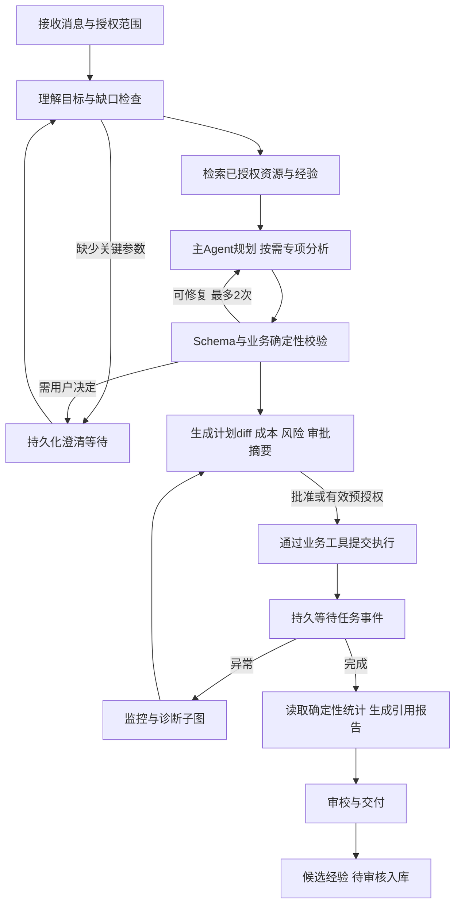

# Agent 与多智能体详细设计

## 1 产品目标与边界

用户用自然语言说明“评什么、评哪些对象、证据要求、时间和预算”，系统通过澄清、资源检索、计划评审、受控执行、监控诊断和带证据报告完成工作。用户能追问、修改目标、取消、在授权范围内恢复，并看见每步调用、费用和真实状态。

必须区分三类对象：①平台编排Agent，帮助用户组织评测；②可注册内部Agent资源，执行专项分析；③被测Agent/多Agent系统（agent_mut），由隔离评测环境观察其表现。③的输出不能进入①的指令层，也不能使用平台真实管理工具。知识库是数据服务，Skill是可复用执行单元，均不因名称而被建成独立聊天Agent。

所谓主流工程水平，至少具备真实模型tool-calling循环、结构化规划、多轮上下文、按需委派、持久化恢复、权限隔离、人工介入、工具幂等、预算/循环控制、流式事件、轨迹评估。不能以多角色文本互相对话取代这些能力；效果水平仍需本项目真实场景评测才能证明。

## 2 技术依据与选择

调研日期2026-09-28，采用官方材料作为参考，具体接口以锁定依赖版本的契约测试为准：

- [LangGraph persistence](https://docs.langchain.com/oss/python/langgraph/persistence)：checkpointer保存会话图状态，store保存跨会话资料；生产采用持久化后端。本项目据此分离运行检查点和审核知识库。
- [LangGraph interrupts](https://docs.langchain.com/oss/python/langgraph/interrupts)：暂停后恢复会重入节点，interrupt之前的代码可能再次执行。本项目审批节点保持无副作用，写工具另设幂等边界。
- [Anthropic 多智能体研究系统](https://www.anthropic.com/engineering/multi-agent-research-system)：分工、工具设计、测试和运行治理共同决定可靠性。本项目只对可独立分析的子问题并行委派，不将每个样本交给一组聊天Agent。
- [Anthropic Managed Agents 架构](https://www.anthropic.com/engineering/managed-agents)：将推理和执行环境解耦提供了工程参考。本项目把Agent规划与确定性执行服务分开，保留稳定工具契约。
- [MCP安全实践](https://modelcontextprotocol.io/docs/2026-07-28/tutorials/security/security_best_practices)：接入外部工具需要明确认证和安全边界。本项目禁止凭证透传给模型，认证主体与工具授权单独校验。

选择LangGraph仅作Agent图执行与checkpointer，使用独立agent-worker和PostgreSQL持久化。API请求创建run后返回202，worker异步执行；对话流不绑定HTTP请求生命周期。领域事实在平台业务表，图状态保存引用；检查点不是任务状态的第二套权威来源。平台自有AgentRuntime接口封装SDK，避免前端/业务依赖SDK类型。

不得额外同时引入另一个多Agent调度框架。供应商模型SDK封装为 `PlanningModel.generate(messages, tools, response_schema, budget)`；返回assistant_text、tool_calls、structured_output、usage、finish_reason、provider_request_id。工具调用参数只按Schema接受；若模型不支持严格结构化输出，解析后校验、最多2次修复，再要求澄清/人工，不降级为正则猜参数执行。

## 3 Agent角色与协作方式

| 角色 | 输入和职责 | 允许输出 | 禁止操作 |
|---|---|---|---|
| 主Agent Coordinator | 用户目标、约束、资源摘要、子分析结果；澄清、规划、汇总、解释 | Clarification、PlanDraft、EvidenceSummary、ReportDraft | 直接SQL改任务/调度、编造资源ID、改分数 |
| 评测方案分析Agent | 复杂目标、候选基准与覆盖矩阵；找覆盖缺口和成本方案 | EvaluationProposal，证据引用与候选ID | 创建任务、自动发布基准、看无授权题库 |
| 监控分析Agent | 指定task逻辑实例、结构化事件、窗口聚合指标 | RiskAssessment、风险趋势与建议 | 改优先级、取消/恢复、反复无变化轮询LLM |
| 异常诊断Agent | 错误码、脱敏日志、版本/调用轨迹、相似案例 | DiagnosticFinding、证据、置信与可验证恢复建议 | 执行恢复、扩大权限、绕过审批 |
| 报告审校Agent | 结构化结果、主Agent报告草稿 | ClaimChecks、遗漏/矛盾、引用有效性 | 生成或更改统计事实、自动对外发布 |

后三者为按需子图，不必每次全部启动。简单单模型固定模板评测：主Agent+确定性校验即可。跨模型/多指标且存在独立方案比较：委派方案分析。出现异常事件才唤醒诊断。报告审校用于正式报告或高风险任务。监控按原文“每任务一个Agent”实现为每task一条持久监控状态和订阅，不意味着每任务常驻一个LLM连接。

委派策略是有上限的主管模式：默认同时≤3个子Agent、深度≤1、单次最多5个专项任务；子Agent不能再自行生成子Agent。相互依赖工作串行，独立证据检索可并行。所有子Agent返回主Agent合并，用户只面对主入口。

委派消息 `Delegation` 字段：delegation_id、run_id、parent_step_id、agent_role/version、objective、success_criteria、input_refs、allowed_tool_ids、budget_slice、deadline、output_schema、context_hash。结果 `DelegationResult`：status、findings、evidence_refs、uncertainties、recommended_actions、usage、artifact_refs。无原始思维链要求，只记录简明决策理由和外显工具轨迹。

子Agent没有共享可写聊天历史；父图发只读上下文快照，子图产出不可变artifact，由父节点按delegation_id确定顺序合并。结果冲突按证据强度排序并标记分歧，不用多数投票决定事实，不无限辩论。关键数据冲突最多1轮补证，仍不确定则给用户选择/人工复核。

## 4 端到端图与状态机

Session生命周期active/archived，Run生命周期created/planning/waiting_user/waiting_approval/executing/waiting_tasks/diagnosing/summarizing/completed/failed/cancelling/cancelled/paused_budget。session可有多个run，但同一session同一时刻最多一个可推进run；通过CAS row_version和active_run_id约束。追加消息在waiting_user直接恢复；executing期间的修改先作为pending_instruction入队，节点安全边界消费，不能修改已批准冻结计划。

重规划生成plan_version+1，并展示diff。已执行部分保留，不在原run上重写历史；新增/改预算/改数据外传范围需要新审批。取消Agent run默认取消其尚未执行的步骤；是否取消已提交评测任务是UI明确选择，默认请求取消子任务；其他会话或手工创建的任务不连带取消。

## 5 计划契约与确定性校验

计划对象与JSON Schema在contracts目录。PlanDraft中只有已授权目录检索得到的ID，版本固定；不得“选最新一条”。资源选择先硬过滤租户/权限/状态/模态/场景/质检/密级，再排序适配度、覆盖度、成本和历史可用性；排序解释包含证据。无合适资源返回resource_gap，不能自动换成相似行业或试跑。

运行中保存GoalSpec：目标、评测对象、范围、指标、禁止事项、预算、deadline、交付格式、待澄清字段。Plan包含schema_version、plan_id/version、goal、mode、resources、nodes、budget、risk、evidence_refs；nodes形成DAG，kind为evaluation/analysis/report，依赖通过node_id表达，不允许任意代码。

校验顺序：JSON Schema→引用存在/版本归属→租户与对象权限→数据发布/质检→模型能力与白名单→工具input/output兼容→DAG环/规模→预算预估与硬上限→数据驻留/副作用→审批要求。每条返回 `code、json_pointer、message、repairable、evidence_ref`。LLM能提建议，只有服务端PolicyEngine可以判allow/deny/require_approval。

计划hash使用规范化JSON计算，包含资源版本、目标、节点、预算、数据范围与执行模式；排除纯展示字段。批准后产生immutable ExecutionSpec，调度只读此spec。业务服务执行前再校验权限与资源状态；“计划已验证”不能作为之后永久有效的通行证。

## 6 工具设计

每个工具定义 name/version、description、input_schema、output_schema、required_permissions、data_scope、effect_class、timeout、retry_policy、idempotent、approval_policy、output_limit、redaction_policy。工具列表按用户权限和本Agent角色交集生成，不把所有工具暴露给所有角色。

| 工具 | 主要输入/输出 | 风险与幂等 |
|---|---|---|
| resources.search | filters→授权资源摘要/版本/能力 | 只读，查询审计 |
| knowledge.search | query、category、filters→片段/引用/更新时间 | 只读，租户过滤在检索前执行 |
| tasks.validate_plan | plan→errors、cost_estimate、risk | 只读，不预先创建任务 |
| tasks.create_experiment | execution_spec_ref、approval_id→experiment/run IDs | 内部写；plan_hash+action幂等 |
| tasks.submit | run_ids、expected_versions→accepted IDs | 内部执行；逐run幂等 |
| tasks.get_status / get_events | task_ids、cursor→状态/事件 | 只读、分页、最小日志 |
| tasks.retry_failed | task、failed_sample_keys、expected_attempt→新attempt IDs | 变更执行；需审批/明确预授权，不能全量重跑 |
| tasks.cancel | task、reason→cancelling/cancelled | 控制操作，范围校验、幂等 |
| results.get_summary / get_evidence | run/cohort/filters→确定统计与引用 | 只读，敏感内容脱敏 |
| reports.generate | snapshot_ref、format→report_job/artifact | 内部写，统计hash+模板版本幂等 |
| knowledge.propose | 来源run、结论、证据→candidate ID | 仅候选写，不能自动成为可信知识 |

工具执行顺序：验证身份→角色allowlist∩调用者权限∩资源策略∩当前委托scope→Schema→风险/审批→预算预占→幂等记录→执行→输出Schema/大小检查→费用结算→审计/结果存储。不能把前端confirmation=true直接传给工具视为授权。

工具结果统一ToolResult：status=success/error/pending、data、error{code,retryable,details}、evidence_refs、artifact_refs、usage、invocation_id。大型结果写Artifact，仅返回摘要与带权限引用；工具输出中的“执行XX命令”一律是数据，不能进入系统提示词。错误最多自动重试2次且仅幂等、可重试类别；权限不足和Schema错误不盲重试。

## 7 审批与副作用

默认：查询与分析自动执行；正式创建/提交、改配、补测、恢复需审批；已有明确的限额预授权可覆盖相同范围的低风险任务。外部发布、真实写文件/数据库/邮件/支付等副作用不因评测任务获批而自动获批。被测Agent环境所有副作用使用stub或独立沙箱，与平台内部创建任务的可信业务写区分。

Approval字段：id、tenant/workspace、requester、allowed_approver_scope、run_id、plan_hash、action_hash、resource_versions、budget_cap、data_egress_scope、expires_at、status、approved_by、approved_at、consumed_invocation_id。默认30分钟有效，可由组织配置；过期重新生成审批。审批UI必须展示将调用何对象、多少样本、预计及最高费用、数据目的地和计划diff，不能只有“是否确认”。

批准API采用CAS把pending→approved，工具消费时在事务内绑定invocation_id并写幂等记录，唯一(action_hash,plan_hash)防双击。批准后改计划/增预算/换模型/扩大数据范围，旧approval无效。若进程在执行成功后、checkpoint前崩溃，恢复查询invocation记录并返回已完成结果，不重新执行。

LangGraph interrupt之前不得调用有副作用工具。节点恢复可能从节点头重入，因此“审批等待”和“执行工具”必须分节点；所有实际写仍依赖工具幂等，而不能仅依赖图检查点。

## 8 持久化、事件与恢复

新增表：agent_definitions/agent_definition_versions（角色、prompt、模型路由、工具白名单、预算）；agent_runs（session、status、graph_version、model_config_version、plan_version、budget_used、lease/fencing）；agent_steps（node、attempt、input/output_ref、status）；agent_delegations；agent_plan_versions；agent_approvals；agent_tool_invocations；agent_events；knowledge_candidates/entries/chunks；agent_monitor_states。外键和唯一约束见契约说明，所有表含tenant范围。

LangGraph checkpoint表由锁定版本管理，checkpoint_namespace=`tenant/session/run`，服务端生成thread_id，不接受用户任意指定读取别人的图。一个worker持有run lease；恢复不能同时启动两个图。图版本固定，部署新图时旧run继续旧版本或显式迁移，不直接重用不兼容checkpoint。

checkpoint存阶段状态、引用、已完成delegation IDs、summary、预算快照，不存密钥/完整题库/无限消息。模型请求与响应记录到受权限Artifact，工具调用有独立持久日志。模型已经返回但checkpoint未落地也可能重调，需保存llm_invocation_id；provider无幂等时记录可能额外成本，不假装恰好一次。

SSE `GET /api/agents/runs/{run_id}/events` 使用fetch流带Bearer，event含event_id、seq、type、run_id、step_id、timestamp、payload。Last-Event-ID或cursor续传，客户端按seq去重；历史太旧410并给snapshot入口。连接断开不取消run。事件类型status_changed、message_delta、plan_ready、tool_started/finished、approval_required、delegation_started/finished、budget_warning、artifact_ready、run_finished。心跳15秒，认证失效关闭并要求重新认证；不得在URL放长效JWT。

轨迹回放只读重建已记录事件；“重新执行”创建新run，冻结原输入并重新检查权限、资源、预算与审批。不能把回放误实现为再次调用外部写工具。

## 9 上下文和知识

上下文分层：稳定系统约束→GoalSpec与确认决策→计划/状态摘要→本节点相关证据→最近对话。默认模型窗口预算留20%输出、10%工具结果裕量，剩余用于输入；具体token量按实际模型能力验证。超限先去重和按相关性截取，再结构化摘要；固定保留禁止事项、已审批边界、版本ID、未解问题，不依赖普通自由文本摘要保留安全约束。

知识检索首期PostgreSQL全文检索+结构化过滤，可用pgvector向量召回后融合排序；无向量模型时明确降级全文，不阻塞流程。检索前限制tenant/workspace/ACL/密级，不能先向量取全库再过滤泄漏。每片段有source_artifact、hash、版本、更新时间、review_status、valid_until；返回原文定位用于引用校验。

经验只在任务完成且结果有效后生成候选，经有knowledge:review的人员审核再入可信库。失败案例也可收录，但必须错误证据和适用版本。用户偏好与业务事实分区；撤销/过期立即停止检索，旧报告仍指向当时证据快照。用户上传文档和工具输出的不可信指令不得覆盖系统约束；模型看不到credential_ref解析后的密钥。

## 10 监控、诊断和报告

MonitorState按task记录last_event_seq、last_summary_hash、risk_level、next_check_at、last_llm_at。确定性监控每30秒聚合吞吐、错误率、重试、预算、队列等待；状态迁移、错误率阈值突破或停滞才触发LLM摘要。相同证据hash不重复分析；默认LLM监控每任务最多5分钟一次，严重新故障可立即触发。这满足持续监控并避免每30秒花一次模型费用。

诊断优先结构化错误：鉴权失败→凭证/权限检查建议；429→速率/Retry-After证据；超时→分布和通道检查；裁判Schema错→版本/响应证据。模型可提出假设但必须区分observed/inferred、confidence和verification_step；不能单凭猜测恢复。恢复建议含受影响sample集合、预期收益、风险、追加预算；主Agent重新校验和审批后调用retry_failed。重复相同恢复失败一次即升级人工，不无限自愈。

报告数字由SQL/统计服务计算，Agent只解释，审校检查每个claim有有效evidence_ref且数值一致。没有证据写“不可判定/待核实”，不能引用相似案例代替本任务事实。报告解释失败不影响已完成评测，回退为结构化事实报告。

## 11 API和前端交互

| API | 请求要点 | 响应/权限 |
|---|---|---|
| POST /api/agents/sessions | workspace_id、goal、mode、budget | session_id/run_id，202；agent:invoke |
| POST /sessions/{id}/messages | client_message_id、content、expected_version | message_id/run_id，幂等；agent:invoke |
| GET /sessions/{id}/messages | cursor、limit≤100 | 授权历史；agent:view |
| GET /runs/{id} | 无 | 状态快照、usage、pending_action；agent:view |
| GET /runs/{id}/events | cursor | SSE；agent:view |
| GET /runs/{id}/plans/{version} | 无 | plan、validation、diff、risk；agent:view |
| POST /runs/{id}/approvals/{aid}/decision | approve/reject、plan_hash、reason、expected_version | 当前approval；agent:confirm |
| POST /runs/{id}/resume | pending_action_id、answer或budget_authorization_id | 202；agent:resume，重验原执行权限 |
| POST /runs/{id}/cancel | cancel_child_tasks、reason | 202；agent:cancel |
| GET /runs/{id}/replay | cursor | 只读轨迹；agent:replay |
| DELETE /sessions/{id} | expected_version | 归档，活动run需先cancel；agent:cancel |

旧`confirm`端点映射到新approval服务，不接受无plan_hash的重复创建。主页面保留Agents.vue入口，增加会话列表、对话输入、任务目标卡、计划DAG/表格、资源和预算、审批diff、任务与子Agent状态、工具活动、证据抽屉、成本统计。用户可编辑计划字段但改动立即产生新版本并使旧审批失效。显示“正在等待模型/工具/用户/任务”，不能用无依据百分比表示Agent思考进度。

无权限按钮隐藏且API仍拒绝；断线重连按cursor恢复；失败提供错误码、已完成部分与可操作恢复项。只显示决策摘要和工具事实，不显示或要求模型私有推理链。

## 12 预算、循环与质量门禁

初始可配置默认：主Agent最多10规划轮；每子Agent6轮；run总工具调用≤40；并行子Agent≤3；深度1；规划活跃时间≤10分钟（waiting_user/tasks不算活跃但受总生命周期期限）；单run模型总Token≤50,000，费用上限必须由workspace设定。达到任一硬限额停止新增调用，保留checkpoint，状态paused_budget或failed并说明具体原因。

同一工具+规范化参数+相同结果hash连续3次无状态变化判LOOP_DETECTED；最多2轮计划修复；工具错误不自动生成新的相同run绕过上限。委派预占预算，子Agent不能借其他子任务额度；收尾释放未使用预算。

最小评测集200个场景：简单配置40、复杂多模型40、缺信息澄清30、故障恢复30、权限/注入/越权40、长会话/重启20；类别可重叠但保存唯一case_id。冻结模型/prompt/tool版本，每场景至少3次运行，报告pass@1/一致性/成本分布。建议首期门槛：合法计划率≥95%、可执行目标完成率≥90%、需澄清识别率≥90%、未授权副作用0、跨租户泄漏0、关键审批绕过0、恢复场景无重复内部副作用100%、报告数值与引用准确率100%。这些是项目验收目标，不是当前已测结果。

对比固定规则基线、单Agent+tools、按需多Agent三种配置，使用相同模型/资源/预算上限；分别报告质量、P50/P95延迟、Token、费用及置信区间。多Agent只在预先定义复杂子集上有可解释收益才默认启用；不能引用厂商其他任务成绩宣称本平台达标。人工审核至少双人独立标注争议集，第三人仲裁，防模型自评自证。
