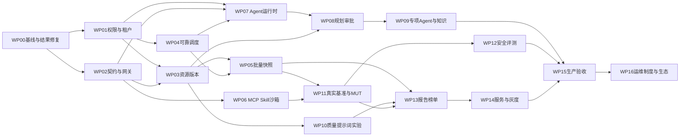

# 研发工作包与AI交接指令

## 1 实施原则与范围

本次交付设计，不自动开始业务开发。后续开发从WP00开始，严格依据依赖顺序；权限、迁移、异常处理、UI反馈、验收证据属于同一工作包，不能留到“后面统一补”。原始Word条文、01差距矩阵与本设计冲突时建立ADR，保留差异和影响，不能静默删需求或追随旧文档过期的完成清单。

每包交付：代码、迁移/回填脚本、接口Schema、对应页面、自动化测试、验收记录、风险与回滚说明。AI每次完成报告写明实现了哪些需求ID、没有做什么、测试实际输出及环境。没有真实模型/数据/证书时标待联调，不用Mock报告宣称完成。

## 2 依赖与里程碑

生产可观测与CI从WP00持续建设，图中WP15表示最终验收，不是届时才开始运维。WP16的制度与数据许可也提前准备，最终交付依赖生产演练。

| 里程碑 | 目标 | 出口门禁 |
|---|---|---|
| M0 基线可信 | WP00 | 有效裁判链路、空输出反例、隔离集成测试可运行 |
| M1 执行底座 | WP01—06 | 隔离/冻结版本、可靠worker、协议契约、真实外部工具 |
| M2 智能评测助手 | WP07—09 | 真实LLM、多轮、审批幂等、恢复、事件与证据，200场景评测 |
| M3 可交付评测 | WP10—14 | 真实基准、可比榜单、报告和服务闭环；每场景独立准入 |
| M4 生产交付 | WP15—16 | 性能/安全/恢复/灰度和组织交付通过 |

## 3 工作包

### WP00 基线恢复与评分正确性

- 前置：无。关联B01/B02/B15/B16、T05、S02/S04。
- 修改范围：backend依赖与测试、task_runner.py、builtin_tools.py、ops.py；新增tests/test_result_semantics.py、tests/test_regressions.py；测试配置完全隔离DB/uploads/logs。
- 工作：建立锁定Python和依赖环境，显式声明SQLAlchemy异步依赖；定位本次端到端超时；修复未定义裁判调用；拆分模型失败/裁判失败/评分不通过；拒绝空预测误判；演示裁判标demo_only；关闭无endpoint模型的正式执行；验收页返回实测记录或unknown，不再常量true。
- 数据变更：结果增加execution_status/score_status/simulation；历史结果默认legacy_unverified，禁止自动计入正式榜单，后续迁移再复核。
- 验收：已知正确/错误样本分数分别1/0；裁判抛异常时任务不为完全成功；空预测两项误判反例不通过；已有13项测试实际执行且加强分数断言；记录未运行部分。
- 回滚：保留旧结果，只关闭新执行入口；不恢复有问题评分作为正式服务。
- 估算：4—6人日。

### WP01 对象授权与租户边界

- 前置WP00；关联D04/M05/V02/O01、I11、B04/B08/B12。
- 范围：models/user/role与新增tenant/workspace，api/deps.py、repository/policy模块、所有业务list/get/export/events、前端stores/router。
- 工作：统一ActorContext、动作+对象授权；迁移默认租户和未知归属隔离；阻止跨租户ID关联；后端所有入口复用；禁用用户不能持旧token调用；敏感预览/导出范围单独控制。
- 验收：双租户、own/shared/all角色矩阵覆盖列表、详情、下载、Agent、batch和知识；未授权数据在搜索/SSE/日志中不可见；输入伪造tenant不改变范围；同权限不同对象仍拒绝。
- 回滚：先上线兼容列再启用强制策略；问题期间收窄或关闭写入口，不回退为全公开。
- 估算：12—18人日。

### WP02 标准契约与统一工具网关

- 前置WP00，正式开启依赖WP01；关联I01/I02/I03/I09/I10、B03/B10。
- 范围：protocol.py、gateway.py、http_adapter.py、resources.py；新增schemas/、services/tool_gateway/、models/resource_version；task_runner/prompt test统一调用。
- 工作：原文Schema+语义校验、版本profile、规范信封和错误、trace传播、usage解析；幂等记录/请求hash；共享限流半开；资源版本不可变；sync/async/stream分发与兼容端点。
- 验收：附录Schema正反例；错误body/空caller/错误token合计拒绝；同correlation不重复写、不同payload409；外部HTTP裁判真正在任务链产生正确分数；子调用延续trace；上游429退避。
- 回滚：网关功能开关按资源启用，旧契约仅留兼容profile；禁止回滚后绕过对象策略。
- 估算：15—22人日。

### WP03 数据模型提示词的不可变版本

- 前置WP01/WP02；关联D01—D07/M01—M06/P01/Q01/Q03、B06/B07/B15。
- 范围：dataset/model/prompt ORM与API、dataset_parser、model_client、quality、对应Vue页面；新增revision和import job。
- 工作：导入暂存/preview/commit，字段映射与文件限制；.xls真实适配；dataset revision/diff/rollback；质检与发布门禁；ModelVersionConfig冻结实际请求；类型安全映射；健康鉴权分类；每资源credential/channel引用；提示词变量Schema。
- 验收：修改数据产生新版本，旧任务hash不变；模型配置切换不改变旧run；版本属于其他对象422/404；未质检/草稿正式任务拒绝；旧xls夹具与ZIP限额；401不能健康；生产明文拒绝。
- 回滚：版本读双路径只用于迁移前历史；新发布对象不降级原位修改；迁移expand/backfill/validate/contract。
- 估算：20—28人日。

### WP04 独立worker与可靠任务状态机

- 前置WP01，网关路径依赖WP02；关联T01—T04、B05。
- 范围：task_queue/task_runner/task_events、models/eval_task；新增work_items/outbox与worker入口、TaskService；Tasks/TaskDetail页面。
- 工作：短事务claim/lease/fencing、DAG/窗口/公平队列、取消重试、逐样本提交、事件去重、重启回收；所有创建路径统一TaskService；任务与run状态兼容映射。
- 验收：两个worker竞争同任务只一个有效claim；kill后恢复已完成样本不重复；旧lease不能回写；依赖环拒绝；上游失败传播；取消后不继续发布成功；独立查询能看实时进度。
- 回滚：停止领取→排空在途→版本化worker回滚；DB已提交进度保留，不能直接重置全部queued。
- 估算：18—25人日。

### WP05 快照批处理与预算流水

- 前置WP03/WP04；关联I07/T03/T05、B08/B09。
- 范围：batch.py/batch_store、EvalResult、UsageReservation/Ledger、storage适配器；TaskDetail分片/费用视图。
- 工作：强制batch-snapshot-tenant绑定、分片Schema/成员/边界、不可变结果Artifact、hash幂等；预算预占结算、paused_budget、30秒进度；活动引用保护GC。
- 验收：错快照/负分片/越界/未知sample拒绝；重复回写不重复token或失败明细；预算并发不能超额预约；中断发布无半文件；活动快照不被7天GC；重启结果和预算一致。
- 回滚：停新batch，保留只读快照和ledger；恢复必须对账，不删除流水。
- 估算：14—20人日。

### WP06 真实MCP Skill与副作用隔离

- 前置WP02/WP01；关联I05/I06/I11、B11。
- 范围：skill_runtime拆为MCP client/Skill executor，sandbox broker和policy，资源配置页。
- 工作：远程MCP协商、能力清单与调用、通知双缓冲；Skill四类型/输出引用/依赖；顶层side_effects；生产出口allowlist和凭证注入；代码在独立受限容器执行，不暴露宿主socket。
- 验收：独立测试MCP服务initialize→list→call/read/get；list_changed时旧调用完成、新调用走新generation；Skill后步读取前步字段；非法引用/循环拒绝；声明副作用触发stub/沙箱；网络/文件越界被实际限制。
- 回滚：禁用新adapter并保留版本记录；在途generation排空；不能以假返回success代替真实能力。
- 估算：18—26人日。

### WP07 持久化Agent运行时

- 前置WP01/WP02/WP04；关联A05/I04。
- 范围：services/agent_runtime、models/agent扩展、agent worker、PlanningModel adapter、SSE；不修改评测调度内部规则。
- 工作：锁定LangGraph/checkpointer、真实tool-calling循环、AgentDefinition版本、run lease、checkpoint、事件、budget/cycle/cancel、只读回放；mock与live provider分离。
- 验收：真实配置模型至少完成一次工具选择→观察→回复；工具Schema非法不执行；模型/工具失效可解释；kill重启从checkpoint恢复；SSE断线续传；同时提交消息不启动两个active run；限轮与费用不能绕过。
- 回滚：新会话切回手工任务配置；已有run按原graph_version排空或取消，不能规则式假Agent冒充升级成功。
- 估算：18—25人日。

### WP08 规划澄清与防重放审批

- 前置WP07/WP03；关联A01/A05/B04。
- 范围：agent_orchestrator替换为主图、Plan/GoalSpec Schema、approval service、TaskService tools、Agents.vue计划/审批工作台。
- 工作：资源硬过滤与检索、GoalSpec、多轮澄清、DAG规划、确定校验、计划diff/hash、审批有效期与消费幂等、任务创建统一入口。
- 验收：缺模型/目标/预算时正确澄清；不选最新不相关资源；无资源返回gap；审批后改数据/预算旧approval失效；重复confirm只一个experiment；从审批节点重启不重复写；Agent无模型ACL不能绕过常规任务限制。
- 回滚：关闭自动提交，保留计划导出和手工配置；所有已批准执行仍按冻结spec处理。
- 估算：16—24人日。

### WP09 专项协作与可信知识

- 前置WP08；关联A02/A03/A04。
- 范围：analysis/monitor/diagnose/review子图、delegation记录、知识候选/索引/审核、Agents.vue证据/子任务视图。
- 工作：按需委派、上下文快照/预算切片、确定性合并；每task监控状态；诊断有证据和验证步骤；恢复回主Agent审批；知识检索权限前置、来源hash与过期、审核入库。
- 验收：简单任务不启动全角色；并行度/深度上限；无变化不重复LLM分析；相同恢复失败升级人工；跨租户片段不召回；报告引用有效；子Agent没有任务写工具；三配置对照评测通过06门禁。
- 回滚：关闭专项Agent，保留确定性监控与主Agent；知识候选不进入可信检索。
- 估算：18—26人日。

### WP10 质量增强与提示词实验

- 前置WP03/WP02；关联Q02/Q03/P02/P03。
- 范围：quality插件、PromptExperiment服务、模型生成/优化、对应Vue页面。
- 工作：格式/一致性/近重复/人工准确性复核；候选提示词生成、开发/保留集隔离、配对统计、预算与发布审核。
- 验收：已知异常能解释且可复核；修复产生新版本并复检；保留集不提供给优化模型；相同样本配对差异可复算；无显著收益不自动发布。
- 回滚：保留旧规则/prompt版本，不删除实验结果；关闭自动候选生成即可。
- 估算：12—18人日。

### WP11 真实场景基准和被测Agent

- 前置WP05/WP06；关联E01—E05/I08。
- 范围：benchmark/metric registry、media adapters、MUT episode sandbox/oracle、task_catalog readiness、基准管理页面。
- 工作：先语言/对话/表格/RAG/代码与金融政务，再媒体、MUT、多Agent、具身/工业/科学适配；每场景独立数据Schema、标尺、许可与校准报告。替换两条样例的正式资格，演示包保留demo标签。
- 验收：每ready场景有真实输入和oracle/人工金标；代码不在宿主执行；媒体不是字符串描述；被测Agent拿不到平台管理工具；最终状态独立验证；不可观测轨迹指标标not_observable。
- 拆分建议：WP11a基准框架，11b文本5场景，11c媒体，11d MUT，11e行业包，11f专用模拟器。任何子包缺资源不阻塞框架，但不能宣布全包完成。
- 回滚：撤销基准ready/公开发布，保留历史结果与版本。
- 估算：框架和首批适配30—45人日；全部行业数据/专业工具另需领域团队，不能纳入纯编码工时承诺。

### WP12 四类安全可信评测

- 前置WP11/WP10；关联S01—S04。
- 范围：risk/watermark/alignment/hallucination evaluator、受控自适应策略、专家复核UI。
- 工作：风险分层+过拒、真实标识元数据/OCR/变换、立场多视角一致性、事实断言/证据与不可判定；动态题库候选双验证、固定集与探索集分开。
- 验收：空输出不满分；答案中的标识不能替被测输出证明；缺证据不判真；对照人工金标≥90%一致且报告各类别表现；真实媒体与多轮夹具；规则版本变化需重新校准。
- 回滚：版本退役，不以旧关键词裁判重新赋正式资格；保留探索结果但禁止入公开比较。
- 估算：20—30人日研发，加专家标注与规则审核周期。

### WP13 可比榜单与证据报告

- 前置WP05/WP10/WP11；关联L01/L02/T05/B13。
- 范围：leaderboard/report_archive、Artifact/ReportJob、Cohort、LeaderboardRelease、Leaderboard/TaskDetail。
- 工作：正式结果资格、同cohort比较、冻结归一化、缺指标/区间/并列、真实成本；结构化报告+解释层、各格式状态、可恢复生成、发布审批。
- 验收：mock/trial/评分错误被排除；不同dataset/judge版本不混排；缺数据不填0；账单可复算；Word/PDF明细可读且导出失败可见；每报告结论有证据ID。
- 回滚：撤回新榜单发布并展示上个合格快照；不得改历史快照。
- 估算：14—20人日。

### WP14 服务单用量与真实灰度

- 前置WP13/WP05/WP02；关联V01—V03/B14。
- 范围：tasks.py拆service模块、报价版本、workspace ledger、shadow router、EvalServices.vue。
- 工作：报价项目快照、审核/创建真实实验/交付状态机；幂等结算；候选与stable真实双调用；评分漂移四门禁、5%流量与7天证据、原子转正/回滚。
- 验收：重复交付不扣两次；服务单不能无报告直接delivered；candidate失败不影响production；伪造客户端score无效；单项漂移超10%或相关性不达标不得转正；常量分数标inconclusive。
- 回滚：原子恢复previous_stable、关闭候选流量；财务流水只能冲正不能删除。
- 估算：14—20人日。

### WP15 生产加固与完整验收

- 前置M1—M3关键路径；关联O02/O03/I12/I13。
- 范围：deploy、CI、migration、telemetry、alerts、admission runner、Ops.vue与运行手册。
- 工作：镜像和SBOM/安全扫描、真实readiness、密钥保护、IaC、蓝绿/滚动/金丝雀、备份恢复、全链路可观测；准入任务替代写死验收结果；压测与故障注入。
- 验收：06全部P0门禁，原文I15基础/完整准入，生产无默认凭证，断电/进程终止/DB断连/证书过期有可控行为；恢复RPO/RTO有实测。
- 回滚：发布前备份及兼容迁移，应用回滚不逆转已写新数据；旧版不兼容时只读/停写恢复，禁止危险自动downgrade。
- 估算：18—26人日，贯穿开发期。

### WP16 运维制度与生态交付

- 前置基础制度可提前，最终依赖WP15；关联O04/O05。
- 范围：docs/operations、contributing、license/SBOM、工单/知识库适配和运营报表。
- 工作：岗位职责、值班/响应、变更/发布/故障/漏洞流程、许可与贡献审核、FAQ与培训、应急演练记录；基准生态章节原文空白部分列待业务定义，不虚构项目承诺。
- 验收：新运维按手册独立完成发布/回滚/恢复演练；工单有负责人和闭环；许可与数据授权可追溯；运营负责人确认组织事项。
- 回滚：制度版本归档、接口停用不删除历史记录。
- 估算：8—12人日技术文档与集成，不包括持续社区运营人员投入。

## 4 工期与团队假设

上述纯研发区间合计约269—391人日，含框架、首批适配与测试，不含全部14行业题库采购/专家标注、专用模拟器对接和企业网络审批。按2后端+1 Agent/评测工程师+1前端+1测试，以及兼职产品、SRE和领域专家，建议约18—24周规划，实际按能力与外部资源调整。这个时间不是上线承诺；若只有一个开发AI和一名验收人员，不能按多人并行日期执行。

建议周次：1—2周M0；3—8周M1；7—13周M2；10—19周M3首批场景；18—24周M4。全部行业/专用场景可另设后续发布，但需求清单保持未完成，不能把首批发布等同项目全量验收。

关键外部输入：可调用的规划模型和裁判模型、脱敏真实数据与许可、领域专家金标、企业证书/网络白名单、生产容量/部署环境、可计费单价。未提供时开发契约与夹具可继续，相关live验收保持待验证。

## 5 给开发AI的执行指令

将下面文本和本目录一起交接：

> 你在E:/eval-platform实施本设计包指定工作包WPxx。先读AGENTS.md、本目录README、01差距矩阵、对应详细设计和06验收。检查git状态及现有实现，不覆盖用户改动。只做该包和必要前置，禁止把Mock/占位结果标记正式能力。先列现有入口、准备改动的领域服务/表/API/页面、迁移和验收用例，再实施。新页面按钮API权限六项同步并运行collect-permissions。测试使用独立数据库和文件目录，不能触碰业务数据库。提交可运行代码、契约、迁移、测试证据、回滚说明和需求ID映射。未提供真实模型/数据则保留明确待联调项。完成报告必须区分实现、测试通过、未验证、阻塞；不得修改验收阈值来使测试通过。发现文档冲突记录ADR，不自行缩减功能。

研发交接文件建议 `docs/delivery/WPxx.md`：基线commit、需求ID、变更摘要、迁移顺序、API差异、权限差异、测试命令/退出码/报告位置、未决问题、回滚步骤。完成一个包后更新追踪矩阵中的“验收状态”列，保留本次核查的历史基线，不直接覆写原始事实。

## 6 防止AI实现走偏的红线

- 禁止把“增加角色prompt”当作多Agent已完成；必须通过delegation、权限、状态、budget和恢复用例。
- 禁止在Agent确认接口直接db.add(EvalTask)绕过TaskService。
- 禁止将生成题库自动设published、将模型自述完成视为oracle、将自评替代人工金标。
- 禁止用字符串相似度证明安全/幻觉/行业能力，用文本图片描述证明多模态。
- 禁止只断言HTTP200或status=success；关键测试必须断言结果数值、对象权限和副作用次数。
- 禁止吞掉报告/评分异常、将unknown补0或依赖失败永久queued。
- 禁止以改变需求/关闭校验/删失败用例完成工作包。
